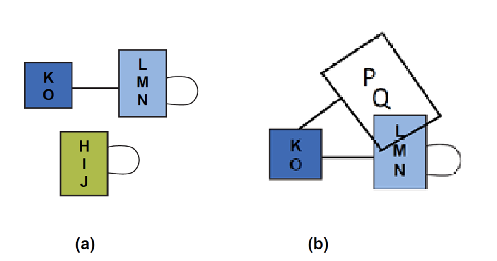

# Reduction-of-A-General-Graph-to-Have-Minimum-Number-of-Edges
**There are two parts in this project: Optimization and Visualization. This repository mainly focuses on visualization part.**

Below is some details of this project:

<h3 align='center'>Optimisation and Visualisation on Edge-Compressed Graphs</h3>

**Introduction**

 

Graphs with highly connected nodes are widely used in various applications, such as ER-relationship in database structures, individuals’ or groups’ relationship in social network, and authors’ or research groups’ collaboration relationship in the research cooperation/colloboration community, the complexity of which makes itdifficult to read and digest. Edge compression offers a tool to re-organize the structure of the graphs representing such kinds of relationships throughclustering the nodes which shares the similar neighbors in one supernode. See the following figure for an example. 

 

 

 

By doing so, we could reduce thenumber of edges while without losing any connection information in the original graph. In order to maximize the profit brought bythe edge compression technique, we seek for the reduction of a general graph to have minimum number ofedges, when it is possible. This is the basic version of our edge compression optimization problem.

 

Apart from the basic optimization problem, we may further define several related variants of this basic formulation.Details follows. In the figure above, we can see that when edges are compressed, not only the number of edges are reduced, we also obtain some supernodes, which are formed by the groups of nodes in the original graph. Thus the graph obtained by doing the edge compression also has less nodes. Hence, another variant of the problem is to minimize the number of nodes in the resulting graph after doing edge compression operations.

 

Moreover, in the subfigure (c) of the above figure, we can see that each supernode is isolated from other supernode. However, in some situation of some applications, the supernodes are permitted to have overlaps. See the following figure as an example.

 

Consequently, we may define the above edge-minimization and node-minimization problem to allow supernode overlapping. And by default, in original problem formulation, in fact supernode overlapping is disallowed.

 

 

**Aims and Objectives:**

 

We plan to solve the following variants of optimization formulations.

 

1. Minimizing the resulting number of edges after applying edge compression operations;

2. Minimizing the resulting number of nodes after applying edge compression operations;

3. Minimizing the resulting number of edges after applying edge compression operations, say by allowing supernode overlapping;

4. Minimizing the resulting number of nodes after applying edge compression operations, say by allowing supernode overlapping;

 

 

 

 

 

 

 

*Part I: Optimisation part of the project:*

 

We plan to study the above related theoretical problems by doing the following tasks:

1) Study the complexity of the above four problems. We expect some variants of the problems are polynomial-time solvable, but some of them are NP-complete.

2) For those variants which can be solved in polynomial time, we will investigate to find the efficient algorithms to solve the problem.

3) For those variants which are NP-complete, we plan to design some good approximation algorithms, say with small approximation factor.

 

 

 

*Part II: Visualization Part of the Project:*

 

Another objective of our project is to design efficient visualization algorithm to give nice visualization on such outputs of graphs (say without or with supernode overlapping) nicely after some edge compression are performed. See the following subfigure (a) for an example of a visualization of a graph without node overlapping, and see the following subfigure (b) for another example of a visualisation with some node overlapping occurrences.

 

 

 

 

 

 

**Methodologies: (Brief)**

 

*Part I: Optimisation part of the project:*

1) For those variants which are polynomial-time solvable, we plan to apply different algorithmic techniques to find the optimal solution: Eg. Dynamic programming, Exact algorithm techniques, Greedy algorithms, Divide and conquer techniques, or a combination of these techniques.

 

2) For those variants which are NP-complete, we plan to give a formal proof by giving a rigorous proof from other famous NP-complete problems, such as 3-SAT problem, Partition problem, 3-Partition problem, Min Vetex cover problem, Min Independent Set problem, etc. Further investigations are needed to obtain the proofs.

 

3) For those variants which are NP-complete, we also plan to design some efficient approximation algorithms with small approximation factor. The best case is that the approximation factor is constant. We’ll apply several approximation techniques to obtain good approximation algorithms. The worse case could be that it is hard to find constant-factor approximation algorithm. In such situation, we then plan to design some approximation algorithm with small approximation factors, which may be logarithmic, or polylogarihmic, or even square root approximation factor.

 

*Part II: Visualization Part of the Project:*

4) For the default output without allowing node overlapping, we tentatively plan to use the spring algorithmic approach by designing different attractive forces and repulsive forces to make the nodes and edges in the output of the algorithms being placed well in appropriate positions.

5) For the output with allowing node overlapping, the output graphs are more complex, we still are thinking of a good way to visualize them.

 

